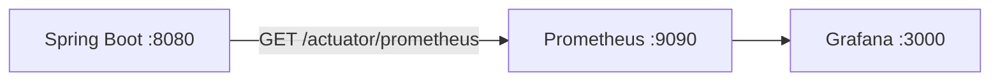

# Prometheus & Grafana (openProject)

This stack scrapes **Spring Boot Actuator** metrics exposed in **Prometheus** format at `/actuator/prometheus`, stores them in **Prometheus**, and visualizes them in **Grafana**.

---

## What was added in the application

| Piece | Purpose |
|--------|--------|
| `micrometer-registry-prometheus` (Maven) | Registers a Prometheus meter registry and exposes metrics. |
| `management.endpoints.web.exposure.include=health,prometheus,metrics,info` | Exposes health, Prometheus scrape endpoint, Micrometer metrics, and basic app info. |
| `management.metrics.tags.application` | Adds an `application` label (value `openProject`) to metrics. |
| `management.metrics.distribution.percentiles-histogram.http.server.requests` | Enables latency histogram buckets for HTTP (for p95/p99 in Grafana). |

---

## Architecture (high level)



- **Spring Boot** exposes metrics (no separate exporter).
- **Prometheus** pulls metrics on a schedule (`scrape_interval`).
- **Grafana** queries Prometheus (data source) and renders dashboards.

---

## Prerequisites

- **Docker** and **Docker Compose** v2.
- Backend reachable at **port 8080** from the Prometheus container (see scenarios below).

---

## Scenario A — Full stack with Docker Compose (recommended for local)

Everything runs in Docker: MongoDB, backend, frontend, Prometheus, Grafana.

### 1. Start the stack **including** the monitoring profile

From the **repository root**:

```bash
docker compose --profile monitoring up --build -d
```

This starts:

| Service | URL | Notes |
|---------|-----|--------|
| MongoDB | `localhost:27017` | Data volume `mongo_data`. |
| Backend | `http://localhost:8080` | `MONGO_URI` points at Compose `mongo`. |
| Frontend | `http://localhost:4200` | |
| **Prometheus** | `http://localhost:9090` | UI: Status → Targets (check `openproject-backend` is **UP**). |
| **Grafana** | `http://localhost:3000` | Default login below. |

### 2. Prometheus: verify targets

1. Open `http://localhost:9090`.
2. **Status → Targets**.
3. Job **openproject-backend** should be **UP** (scrapes `http://backend:8080/actuator/prometheus` inside the Docker network).

If the target is **DOWN**, confirm the `backend` container is running and healthy (`docker compose ps`).

### 3. Grafana: login and open the dashboard

1. Open `http://localhost:3000`.
2. **Login:** `admin` / `admin` (change password when prompted).
3. **Dashboards → openProject — Spring Boot (Micrometer)** (provisioned from `monitoring/grafana/dashboards/`).

The datasource **Prometheus** is provisioned automatically (`http://prometheus:9090` inside Docker).

### 4. Quick PromQL checks (optional)

In Prometheus → **Graph**:

- `up{job="openproject-backend"}` → should be `1`.
- `process_uptime_seconds` → JVM uptime.
- `http_server_requests_seconds_count` → HTTP request counter.

---

## Scenario B — Backend on the host, Prometheus in Docker

Use this when you run `./mvnw spring-boot:run` (or IntelliJ) on **localhost:8080** and only Prometheus (+ Grafana) in Docker.

### 1. Start the backend on the host

Ensure `http://localhost:8080/actuator/prometheus` returns metrics (e.g. open in a browser or `curl -s http://localhost:8080/actuator/prometheus | head`).

### 2. Point Prometheus at the host

The default `monitoring/prometheus/prometheus.yml` scrapes **`backend:8080`** (Docker service name). For a host-run app, use a config that targets the host:

**macOS / Windows (Docker Desktop):**

1. Copy the example:

   ```bash
   cp monitoring/prometheus/prometheus-host.yml.example monitoring/prometheus/prometheus.yml
   ```

2. Or edit `monitoring/prometheus/prometheus.yml` so `static_configs.targets` is `host.docker.internal:8080` (see example file comments).

**Linux:** `host.docker.internal` may be missing. Either:

- Add to the **prometheus** service in `docker-compose.yml`:

  ```yaml
  extra_hosts:
    - "host.docker.internal:host-gateway"
  ```

- Or set targets to your machine’s LAN IP, e.g. `192.168.1.x:8080`.

### 3. Run only Prometheus + Grafana

You can start **only** monitoring services if the backend is already on the host (adjust compose as needed). For example, temporarily:

- Run backend + mongo as usual, **or**
- Use a minimal compose override that only runs `prometheus` and `grafana` on the same compose network.

Simplest path: run **full compose** with monitoring profile (Scenario A) so `backend` is always resolvable as `backend:8080`.

---

## Scenario C — Production / cloud

1. **Expose metrics safely**  
   - Prefer **network policies** or **private subnets** so `/actuator/prometheus` is not public.  
   - Optionally put Prometheus/Grafana in the same VPC as the app, or use a managed Prometheus (e.g. Grafana Cloud, AWS AMP).

2. **Spring Security**  
   - This project currently allows all routes at the security filter level; **treat `/actuator/*` as sensitive** in production.  
   - Restrict by IP, reverse proxy, or Spring Security rules for `/actuator/prometheus` and `/actuator/metrics`.

3. **Secrets**  
   - Change Grafana **admin** password (env vars in compose or Grafana UI).  
   - Do not commit production credentials.

4. **Scrape URL**  
   - Point Prometheus at your deployed backend, e.g. `https://api.example.com/actuator/prometheus`, with TLS and auth as required.

---

## Importing additional Grafana dashboards

Community dashboards (optional):

1. Grafana → **Dashboards → New → Import**.
2. Enter a dashboard ID from [grafana.com/grafana/dashboards](https://grafana.com/grafana/dashboards/) (e.g. search “JVM Micrometer”).
3. Select the **Prometheus** datasource.

Ensure metric names match your Spring Boot / Micrometer version (Spring Boot 3.x uses names like `http_server_requests_seconds_*`).

---

## Troubleshooting

| Symptom | What to check |
|--------|----------------|
| Prometheus target **DOWN** | Backend up? Correct host/port? Firewall? From Prometheus container: `wget -qO- http://backend:8080/actuator/prometheus` (or host URL). |
| Empty Grafana panels | Time range, Prometheus datasource URL, job name matches scrape config. |
| No `http_server_*` metrics | Hit the API a few times; metrics appear after traffic. |
| High cardinality | Avoid `uri` labels in production alerts; use `outcome` or `status` aggregates. |

---

## Files in this folder

| Path | Role |
|------|------|
| `prometheus/prometheus.yml` | Scrape config (Docker Compose `backend:8080`). |
| `prometheus/prometheus-host.yml.example` | Example for host-run backend. |
| `grafana/provisioning/datasources/` | Auto-configure Prometheus datasource. |
| `grafana/provisioning/dashboards/` | Load dashboards from `dashboards/` JSON. |
| `grafana/dashboards/openproject-spring-boot.json` | Starter dashboard |

---

## Stopping the monitoring stack

```bash
docker compose --profile monitoring down
```

Volumes (Grafana/Prometheus data) are not defined in the default compose; Prometheus data is ephemeral unless you add a volume. Add persistent volumes if you need history across restarts.
